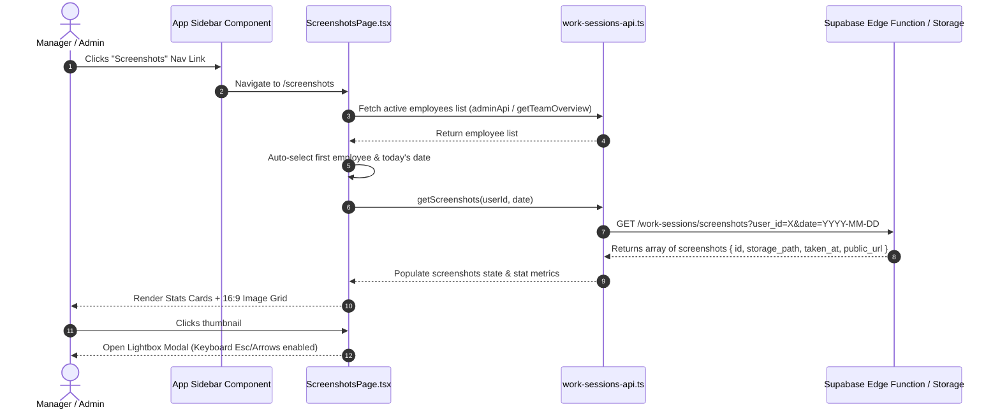

# LC Monitor — Day 1 & Day 2 Completion Walkthrough

This document outlines the changes, architecture, and end-to-end workflow completed across **Day 1** and **Day 2** of the LC Monitor development sprint.

---

## 📅 Day 1 — Environment Setup & Bug Cleanup

### 🎯 Objectives Completed
1. **Resolved Import Conflicts:** Fixed duplicate component naming collision in [`src/App.tsx`](file:///d:/SLDM/Lc-Monitor-main/src/App.tsx) by aliasing the admin browser history component as `AdminBrowserHistoryPage`.
2. **Environment & App Verification:** Verified environment configuration, Supabase client initialization, and verified that all existing routes load cleanly without build or runtime errors.
3. **Production Build Cleanliness:** Verified `npm run build` bundles without type errors or bundler failures.

---

## 📅 Day 2 — Screenshots Page (Frontend UI)

### 🎯 Objectives Completed
1. **Created Screenshots Page Component ([`src/pages/ScreenshotsPage.tsx`](file:///d:/SLDM/Lc-Monitor-main/src/pages/ScreenshotsPage.tsx)):**
   - **Role-based Access Control:** Only `ADMIN` and `MANAGER` roles can access the page. Unprivileged users see a sleek "Access Denied" view with guidance.
   - **Dynamic Employee Selector:** 
     - Administrators see all active workforce employees (via `adminApi.getUsers()`).
     - Managers see members belonging to their direct team (via `workSessionsApi.getTeamOverview()`).
   - **Date Filter:** Standardized date picker defaulting to the current date (`YYYY-MM-DD`).
   - **Responsive Screenshot Grid:** Modern 16:9 thumbnail grid with subtle hover animations, zoom icons, blurred image badges, and formatted timestamp labels.
   - **Full-Screen Modal Preview:** Interactive lightbox modal supporting keyboard navigation (`Escape` to close, `ArrowLeft` / `ArrowRight` to step through images) and on-screen controls.
   - **Live Statistics Cards:** Real-time summary displaying Total Screenshots Captured, Earliest Capture Time, and Latest Capture Time.
   - **Skeleton Loading & Fallbacks:** Polished loading placeholders during fetching and fallback UI (`ImageOff`) if image assets fail to render.

2. **Added API Endpoint Binding ([`src/lib/work-sessions-api.ts`](file:///d:/SLDM/Lc-Monitor-main/src/lib/work-sessions-api.ts)):**
   - Added `getScreenshots(userId: string, date: string)` method pointing to `screenshots?user_id=${userId}&date=${date}`. Supports production PHP proxy (`/supabase-proxy.php`) and local Supabase Edge Functions.

3. **App Navigation & Multi-Layer Route Protection:**
   - **Authentication Layer ([`src/App.tsx`](file:///d:/SLDM/Lc-Monitor-main/src/App.tsx) & [`src/components/ProtectedRoute.tsx`](file:///d:/SLDM/Lc-Monitor-main/src/components/ProtectedRoute.tsx)):** Wrapped in `<ProtectedPage>`, which checks `isAuthenticated` via `AuthContext`. Unauthenticated users attempting to open `/screenshots` are automatically redirected to `/login`.
   - **Role Authorization Layer ([`src/pages/ScreenshotsPage.tsx`](file:///d:/SLDM/Lc-Monitor-main/src/pages/ScreenshotsPage.tsx)):** Checks `user.role`. If an logged-in `EMPLOYEE` tries to access `/screenshots`, the page renders a `ShieldAlert` "Access Denied" view preventing access to employee images.
   - **Sidebar Visibility Scoping ([`src/components/AppSidebar.tsx`](file:///d:/SLDM/Lc-Monitor-main/src/components/AppSidebar.tsx)):** The "Screenshots" menu link is filtered and rendered only for users with `MANAGER` or `ADMIN` roles.
   - **Backend Token Security ([`src/lib/work-sessions-api.ts`](file:///d:/SLDM/Lc-Monitor-main/src/lib/work-sessions-api.ts)):** Every API request includes `getAuthHeaders()` (Bearer JWT token), ensuring Supabase Edge Functions validate the user's session server-side.

---

## 🔄 End-to-End Workflow & Data Flow

---

## 🛠️ Summary of Files Created & Modified

| File | Type | Purpose |
|---|---|---|
| [`src/pages/ScreenshotsPage.tsx`](file:///d:/SLDM/Lc-Monitor-main/src/pages/ScreenshotsPage.tsx) | **NEW** | Full Screenshots view with selector, date picker, grid, stats, and lightbox modal |
| [`src/lib/work-sessions-api.ts`](file:///d:/SLDM/Lc-Monitor-main/src/lib/work-sessions-api.ts) | **MODIFIED** | Added `getScreenshots(userId, date)` API handler |
| [`src/App.tsx`](file:///d:/SLDM/Lc-Monitor-main/src/App.tsx) | **MODIFIED** | Fixed duplicate imports & registered `/screenshots` route |
| [`src/components/AppSidebar.tsx`](file:///d:/SLDM/Lc-Monitor-main/src/components/AppSidebar.tsx) | **MODIFIED** | Added Screenshots item with `Camera` icon for Manager & Admin |

---

## 🚀 Verification & Build Status

- **Type Check:** `npx tsc --noEmit` passed with 0 errors.
- **Production Build:** `npm run build` compiled successfully (dist folder generated cleanly).
- **Git Commit:** Committed and pushed to `farhansldm/LC-Monitor` repository (`main` branch).
